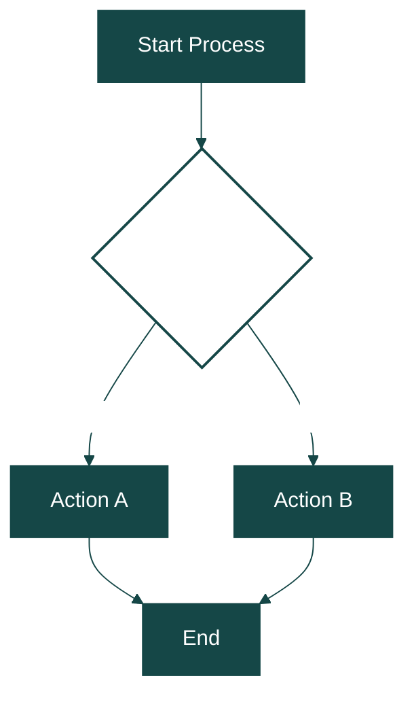
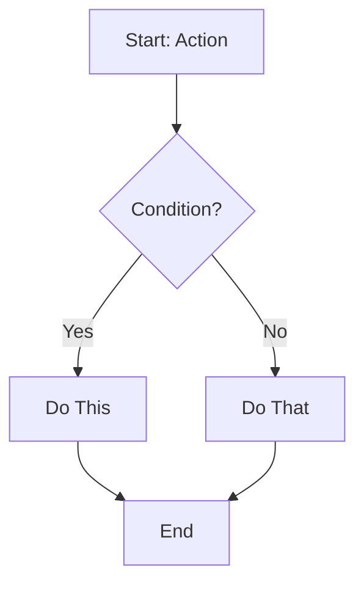
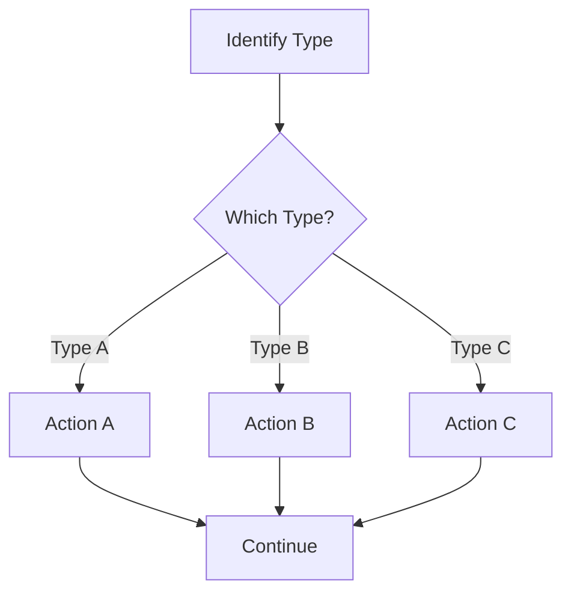
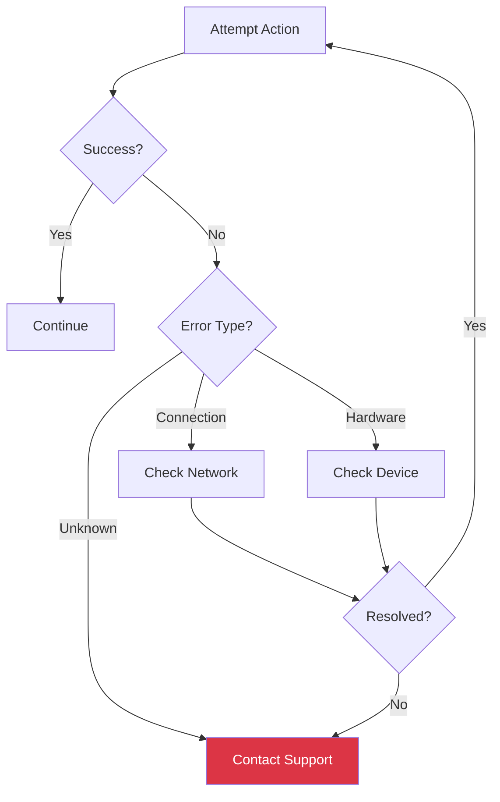

# Visual Elements Guide

Implementation patterns for flowcharts, callout boxes, tables, and color-coding in TFCU procedures.

## Table of Contents (Clickable)

For longer procedures, create a clickable TOC that links to section bookmarks.

### Implementation

```javascript
const { Paragraph, TextRun, InternalHyperlink, Bookmark, BorderStyle } = require('docx');

// Spec: TOC links use teal (#154747) without underline
function createTableOfContents(sections) {
  // sections = [{ title: "System Access", anchor: "system-access" }, ...]
  const tocLinks = sections.map((s, i) => [
    new InternalHyperlink({
      anchor: s.anchor,
      children: [new TextRun({ text: s.title, color: "154747", font: "Calibri", size: 20 })]
    }),
    ...(i < sections.length - 1 ? [new TextRun({ text: "  •  ", size: 20, color: "999999", font: "Calibri" })] : [])
  ]).flat();

  return new Paragraph({
    spacing: { before: 80, after: 100 },
    children: [new TextRun({ text: "Contents: ", bold: true, size: 20, font: "Calibri" }), ...tocLinks]
  });
}

// Section headers: sentence case, 14pt bold, teal color, 1.5pt bottom border
// IMPORTANT: Do NOT use bookmark property on Paragraph - it doesn't work!
function createSectionHeader(text, bookmarkId, pageBreakBefore = false) {
  const children = bookmarkId
    ? [new Bookmark({ id: bookmarkId, children: [new TextRun({ text: text, bold: true, size: 28, font: "Calibri", color: "154747" })] })]
    : [new TextRun({ text: text, bold: true, size: 28, font: "Calibri", color: "154747" })];

  return new Paragraph({
    pageBreakBefore,
    spacing: { before: 180, after: 60 },
    border: { bottom: { style: BorderStyle.SINGLE, size: 12, color: "154747" } },  // 1.5pt
    children
  });
}
```

### Usage

```javascript
// In document children array:
children: [
  // ... header, overview ...
  
  ...createTableOfContents([
    { title: "System Access", anchor: "system-access" },
    { title: "Card Selection", anchor: "card-selection" },
    { title: "Troubleshooting", anchor: "troubleshooting" }
  ]),
  
  // ... other content ...
  
  createSectionHeader("SYSTEM ACCESS", "system-access"),
  // ... section content ...
  
  createSectionHeader("CARD SELECTION", "card-selection"),
  // ... section content ...
]
```

### When to Include TOC

| Include TOC | Skip TOC |
|-------------|----------|
| 5+ major sections | 1-3 sections |
| Document > 3 pages | Document ≤ 2 pages |
| Training reference material | Quick reference cards |
| Complex multi-step procedures | Simple linear workflows |

---

## TFCU Brand Colors

```javascript
const TFCU_COLORS = {
  // Primary branding
  PRIMARY_TEAL: "154747",     // Header backgrounds, section borders, TOC links
  LIGHT_TEAL: "E8F4F4",       // Header table row 2 background
  OVERVIEW_TEAL: "0F4761",    // Overview heading text

  // Neutrals
  WHITE: "FFFFFF",            // Text on teal, default background
  LIGHT_GRAY: "F2F2F2",       // Alternating table rows
  BLACK: "000000",            // Body text, borders
  GRAY_TEXT: "666666",        // Footer text

  // Callout boxes (spec-compliant v2.2)
  WARNING_BG: "FFF2CC",       WARNING_BORDER: "FFC000",   // Gold
  NOTE_BG: "D1ECF1",          NOTE_BORDER: "2E74B5",      // Blue
  CRITICAL_BG: "F8D7DA",      CRITICAL_BORDER: "C00000",  // Red
  TIP_BG: "E2F0D9",           TIP_BORDER: "548235",       // Green

  // Flowchart-specific
  ERROR_NODE: "DC3545",       // Red for error states
  SUCCESS_NODE: "28A745"      // Green for success states
};
```

---

## Callout Boxes

### Types and Usage

| Type | Icon | Background | Border | Use When |
|------|------|------------|--------|----------|
| WARNING | ⚠️ | #FFF2CC | #FFC000 | Action could cause errors or data issues |
| NOTE | ℹ️ | #D1ECF1 | #2E74B5 | Helpful context, tips, additional info |
| CRITICAL | ⛔ | #F8D7DA | #C00000 | Compliance requirement, security, must-do |
| TIP | ✅ | #E2F0D9 | #548235 | Best practice, efficiency suggestion |

### docx-js Implementation

```javascript
const { Paragraph, TextRun, BorderStyle, ShadingType } = require('docx');

// Spec: 4pt left border (size: 32), 0.15" indents (216 DXA), 6pt spacing (120 twips)
function createCalloutBox(type, text) {
  const configs = {
    WARNING:  { bg: "FFF2CC", border: "FFC000", icon: "⚠️" },
    NOTE:     { bg: "D1ECF1", border: "2E74B5", icon: "ℹ️" },
    CRITICAL: { bg: "F8D7DA", border: "C00000", icon: "⛔" },
    TIP:      { bg: "E2F0D9", border: "548235", icon: "✅" }
  };

  const config = configs[type];

  return new Paragraph({
    shading: { fill: config.bg, type: ShadingType.CLEAR },
    border: {
      left: { style: BorderStyle.SINGLE, size: 32, color: config.border }  // 4pt
    },
    indent: { left: 216, right: 216 },  // 0.15"
    spacing: { before: 120, after: 120 },  // 6pt
    children: [
      new TextRun({ text: config.icon + " ", bold: true, size: 20, font: "Calibri" }),
      new TextRun({ text, size: 20, font: "Calibri" })
    ]
  });
}

// Usage
createCalloutBox("WARNING", "Do not enter the MICR account number."),
createCalloutBox("CRITICAL", "Always activate cards, even when reprinting.")
```

### Best Practices

**Do:**
- Place warnings BEFORE the step they apply to
- Keep callout text to 1-2 sentences
- Use one callout type per message (don't combine WARNING + CRITICAL)
- Reserve CRITICAL for true compliance/security issues

**Don't:**
- Use callouts for every piece of information
- Put multiple instructions inside a single callout
- Use WARNING for mere tips (use TIP instead)
- Stack multiple callouts consecutively

---

## Tables

### Standard Data Table

```javascript
const { Table, TableRow, TableCell, Paragraph, TextRun, 
        BorderStyle, WidthType, ShadingType, AlignmentType } = require('docx');

const tableBorder = { style: BorderStyle.SINGLE, size: 1, color: "000000" };
const cellBorders = { top: tableBorder, bottom: tableBorder, left: tableBorder, right: tableBorder };

function createDataTable(headers, rows) {
  const headerRow = new TableRow({
    tableHeader: true,
    children: headers.map(text =>
      new TableCell({
        shading: { fill: "154747", type: ShadingType.CLEAR },
        borders: cellBorders,
        children: [new Paragraph({
          alignment: AlignmentType.CENTER,
          children: [new TextRun({ text, bold: true, color: "FFFFFF" })]
        })]
      })
    )
  });
  
  const dataRows = rows.map((row, rowIndex) =>
    new TableRow({
      children: row.map(text =>
        new TableCell({
          borders: cellBorders,
          shading: { 
            fill: rowIndex % 2 === 0 ? "FFFFFF" : "F2F2F2", 
            type: ShadingType.CLEAR 
          },
          children: [new Paragraph({ children: [new TextRun(text)] })]
        })
      )
    })
  );
  
  return new Table({
    columnWidths: headers.map(() => Math.floor(9360 / headers.length)),
    rows: [headerRow, ...dataRows]
  });
}

// Usage
createDataTable(
  ["Card Type", "BIN Number", "Activation Location"],
  [
    ["Consumer Debit", "41139300", "Card@Once"],
    ["Business Debit", "42616400", "Card@Once"],
    ["Consumer Credit", "41205400", "FIS Payment One"],
    ["Business Credit", "47444300", "FIS Payment One"]
  ]
)
```

### Quick Reference Box

Two-column table for at-a-glance information:

```javascript
function createQuickReferenceBox(items) {
  // items = [{ label: "Support Phone", value: "1-800-237-3387" }, ...]
  
  const headerRow = new TableRow({
    children: [
      new TableCell({
        columnSpan: 2,
        shading: { fill: "154747", type: ShadingType.CLEAR },
        borders: cellBorders,
        children: [new Paragraph({
          alignment: AlignmentType.CENTER,
          children: [new TextRun({ text: "QUICK REFERENCE", bold: true, color: "FFFFFF" })]
        })]
      })
    ]
  });
  
  const dataRows = items.map((item, index) =>
    new TableRow({
      children: [
        new TableCell({
          width: { size: 3500, type: WidthType.DXA },
          shading: { fill: index % 2 === 0 ? "FFFFFF" : "F2F2F2", type: ShadingType.CLEAR },
          borders: cellBorders,
          children: [new Paragraph({ children: [new TextRun({ text: item.label, bold: true })] })]
        }),
        new TableCell({
          width: { size: 5860, type: WidthType.DXA },
          shading: { fill: index % 2 === 0 ? "FFFFFF" : "F2F2F2", type: ShadingType.CLEAR },
          borders: cellBorders,
          children: [new Paragraph({ children: [new TextRun(item.value)] })]
        })
      ]
    })
  );
  
  return new Table({
    columnWidths: [3500, 5860],
    rows: [headerRow, ...dataRows]
  });
}
```

### Revision History Table

**Important:** Per spec, never generate empty placeholder rows. If no revision history exists, create a single row with the current date and "Initial version".

```javascript
function createRevisionTable(revisions = []) {
  const headers = ["Date Updated", "Reviewed By", "Changes Made"];
  const widths = [25, 25, 50]; // Percentage widths per spec

  const headerRow = new TableRow({
    tableHeader: true,
    children: headers.map((text, i) =>
      new TableCell({
        width: { size: widths[i], type: WidthType.PERCENTAGE },
        shading: { fill: "154747", type: ShadingType.CLEAR },
        borders: cellBorders,
        children: [new Paragraph({
          alignment: AlignmentType.CENTER,
          spacing: { before: 40, after: 40 },
          children: [new TextRun({ text, bold: true, color: "FFFFFF", size: 20 })]
        })]
      })
    )
  });

  // Use provided revisions, or create default "Initial version" row
  const data = revisions.length > 0 ? revisions : [
    { date: new Date().toLocaleDateString('en-US', { month: 'long', year: 'numeric' }),
      reviewer: "Author",
      changes: "Initial version" }
  ];

  const dataRows = data.map((rev, index) => {
    const shade = index % 2 === 1 ? { fill: "F2F2F2", type: ShadingType.CLEAR } : undefined;
    return new TableRow({
      children: [rev.date, rev.reviewer, rev.changes].map((text, i) =>
        new TableCell({
          width: { size: widths[i], type: WidthType.PERCENTAGE },
          borders: cellBorders,
          shading: shade,
          children: [new Paragraph({
            alignment: AlignmentType.LEFT,
            spacing: { before: 40, after: 40 },
            children: [new TextRun({ text, size: 20 })]
          })]
        })
      )
    });
  });

  return new Table({
    width: { size: 100, type: WidthType.PERCENTAGE },
    rows: [headerRow, ...dataRows]
  });
}
```

---

## Flowcharts

### Mermaid to PNG Workflow

Flowcharts must be rendered as images since docx-js cannot embed Mermaid directly.

#### Step 1: Create Mermaid Diagram



#### Step 2: Render to PNG

```bash
# Install mermaid-cli
npm install -g @mermaid-js/mermaid-cli

# Render with TFCU styling
npx mmdc -i diagram.mmd -o diagram.png -w 800 -H 600 -b white
```

#### Step 3: Embed in Document

```javascript
const { Paragraph, ImageRun, AlignmentType } = require('docx');
const fs = require('fs');

new Paragraph({
  alignment: AlignmentType.CENTER,
  spacing: { before: 200, after: 200 },
  children: [new ImageRun({
    type: "png",
    data: fs.readFileSync("diagram.png"),
    transformation: { width: 600, height: 450 },
    altText: {
      title: "Process Flowchart",
      description: "Shows decision flow for the procedure",
      name: "flowchart"
    }
  })]
})
```

### Flowchart Patterns

#### Basic Decision Flow


#### Multi-Branch Decision


#### Error Handling


### Flowchart Style Rules

| Element | Shape | Style |
|---------|-------|-------|
| Start/End | Rectangle | fill:#154747,color:#fff |
| Action | Rectangle | Default (white) |
| Decision | Diamond | fill:#fff,stroke:#154747,stroke-width:2px |
| Error/Stop | Rectangle | fill:#dc3545,color:#fff |
| Success | Rectangle | fill:#28a745,color:#fff |

**Text Guidelines:**
- Maximum 5 words per node
- Use action verbs (Select, Enter, Verify)
- Avoid articles (the, a, an)
- Branch labels: 2-3 words maximum

### When to Use Flowcharts

**Use flowcharts when:**
- Process has 3+ decision points
- Multiple paths lead to different outcomes
- Error handling has multiple branches
- Parallel processes exist
- New staff need quick visual overview

**Don't use flowcharts when:**
- Process is strictly linear (use numbered list)
- Fewer than 3 decision points
- Procedure is very short (under 5 steps)
- Adding visual would duplicate step content

---

## Images

### Sizing Guidelines

| Image Type | Width | Height | Notes |
|------------|-------|--------|-------|
| Full screenshot | 500-600px | Auto | Scale proportionally |
| Dialog/popup | 300-400px | Auto | Maintain aspect ratio |
| Button/icon | 100-150px | Auto | Can inline with text |
| Flowchart | 600-700px | 400-500px | Full width for clarity |
| Data table image | 500px | Auto | If too complex for docx table |

### Implementation

```javascript
const { Paragraph, ImageRun, AlignmentType } = require('docx');
const fs = require('fs');

// Centered image with caption
new Paragraph({
  alignment: AlignmentType.CENTER,
  spacing: { before: 120, after: 60 },
  children: [new ImageRun({
    type: "png",  // REQUIRED: must specify type
    data: fs.readFileSync("screenshot.png"),
    transformation: { width: 450, height: 280 },
    altText: {
      title: "Card Type Selection Screen",      // REQUIRED
      description: "Dropdown menu showing card type options",  // REQUIRED
      name: "card-type-selection"               // REQUIRED
    }
  })]
}),
new Paragraph({
  alignment: AlignmentType.CENTER,
  spacing: { after: 200 },
  children: [new TextRun({ text: "Figure 1: Card Type Selection", italics: true, size: 20 })]
})
```

### Best Practices

**Include images that:**
- Show specific UI elements users need to locate
- Demonstrate correct data entry examples
- Display error messages for troubleshooting
- Clarify complex layouts

**Exclude images that:**
- Show generic/obvious home screens
- Duplicate information in written steps
- Are low resolution or illegible
- Are purely decorative

---

## Headers and Footers

### Footer Implementation

```javascript
const { Footer, Paragraph, TextRun, TabStopType, TabStopPosition, PageNumber } = require('docx');

const footer = new Footer({
  children: [new Paragraph({
    tabStops: [
      { type: TabStopType.CENTER, position: TabStopPosition.MAX / 2 },
      { type: TabStopType.RIGHT, position: TabStopPosition.MAX }
    ],
    children: [
      new TextRun("Card Services"),           // Left: Department
      new TextRun("\t"),                       // Tab to center
      new TextRun("\t"),                       // Tab to right
      new TextRun("Card@Once Procedure Page "), // Right: Procedure name
      new TextRun({ children: [PageNumber.CURRENT] })
    ]
  })]
});

// Use in document section
sections: [{
  properties: { /* ... */ },
  footers: { default: footer },
  children: [ /* ... */ ]
}]
```

### Header with Logo (Optional)

```javascript
const { Header, Paragraph, ImageRun, AlignmentType } = require('docx');

const header = new Header({
  children: [new Paragraph({
    alignment: AlignmentType.RIGHT,
    children: [new ImageRun({
      type: "png",
      data: fs.readFileSync("tfcu-logo.png"),
      transformation: { width: 100, height: 40 },
      altText: { title: "TFCU Logo", description: "Tongass Federal Credit Union", name: "logo" }
    })]
  })]
});
```
